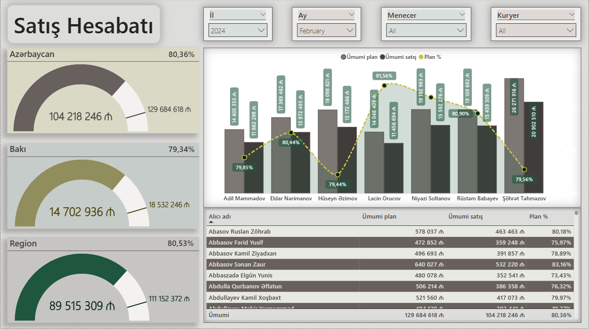
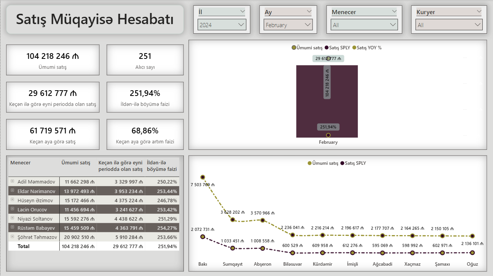

# Commercial Sales Analysis & Comparison Dashboard

## 📌 Layihə Haqqında (Overview)
Bu layihə, şirkətin satış fəaliyyətini həm ümumi dinamika, həm də müqayisəli analiz aspektindən qiymətləndirmək üçün hazırlanmış interaktiv Power BI hesabatlarından ibarətdir. Layihə iki əsas idarəetmə panelini (dashboard) əhatə edir: **Satış Hesabatı** və **Satış Müqayisə Hesabatı**.

---

## 📊 Hesabatların Strukturu (Dashboard Structure)

### 1. Satış Hesabatı (Sales Report)
Bu panel, biznesin ümumi satış sağlamlığını və cari vəziyyətini izləmək üçün nəzərdə tutulmuşdur.
* **Əsas KPI-lar:** Ümumi gəlir (Revenue), mənfəət marjası, ümumi sifariş sayı və ortalama səbət dəyəri.
* **Trend Analizi:** Satışların zaman oxu (aylıq/rüblük) üzrə dinamikası və artım istiqamətləri.
* **Struktur:** Məhsul kateqoriyaları və menecerlərin performans göstəriciləri.

📸 **Satış Hesabatından Ekran Görüntüsü:**

### 2. Satış Müqayisə Hesabatı (Sales Comparison Report)
Bu panel, fərqli dövrlərin, regionların və ya məhsul qruplarının performansını bir-biri ilə qarşılaşdırmaq və zəif/güclü tərəfləri aşkar etmək üçün formalaşdırılmışdır.
* **Dövri Müqayisə:** Cari ilin nəticələrinin ötən ilin eyni dövrü ilə (YoY - Year-over-Year) müqayisəsi.
* **Cross-Analysis:** Regionlar arası satış həcminin və mənfəətliliyin effektivlik müqayisəsi.
* **Hədəf vs Fakt:** Müəyyən olunmuş satış hədəfləri (Targets) ilə real nəticələrin vizual qarşılaşdırılması.

📸 **Satış Müqayisə Hesabatından Ekran Görüntüsü:**

---

## 🛠️ Texniki Alətlər və Metodologiya (Technical Stack)
- **Power BI Desktop & Power Query:** Dağınıq datanın təmizlənməsi (ETL), verilənlər tipinin nizamlanması və ulduz (Star Schema) modelinin qurulması.
- **DAX (Data Analysis Expressions):** - Dinamik zaman analizi (Time Intelligence) funksiyaları (YTD, SAMEPERIODLASTYEAR).
  - Cari və keçmiş dövrlərin fərqini və faiz artımını hesablayan mürəkkəb metrikalar.

## 🚀 Layihəni Necə İstifadə Etməli? (How to Run)
1. Repository-dəki `.pbix` formatlı faylı kompüterinizə endirin.
2. Faylı açmaq üçün kompüterinizdə **Power BI Desktop** proqramının yüklü olduğundan əmin olun.
3. Hesabat səhifələri arasında keçid edərək filtrlərdən (Slicers) istifadə edin və datanı interaktiv şəkildə araşdırın.
